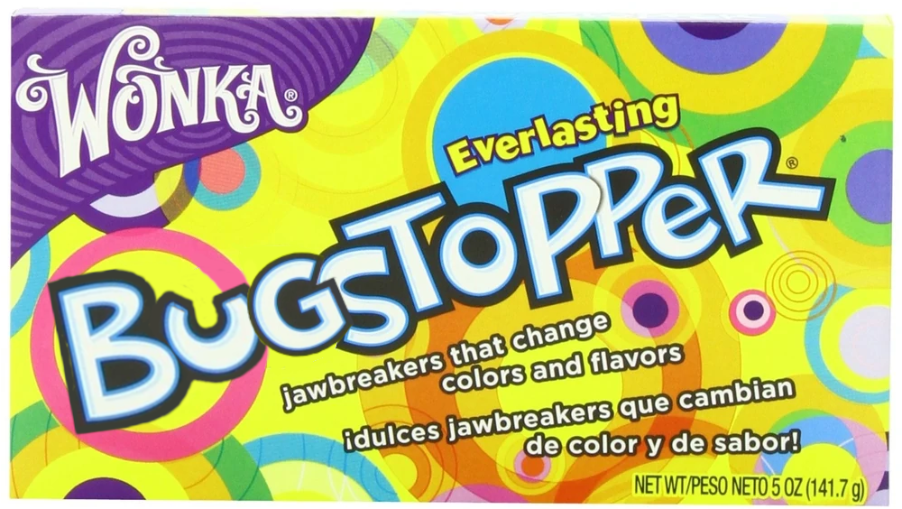

### Hi there 👋

I'm a devtools engineer! Check out [averyharnish.com](https://averyharnish.com) for my personal site.

#### Professional Repositories

I'm currently working on the [🤖 Rover CLI](https://github.com/apollographql/rover) at [Apollo GraphQL](https://apollographql.com). Related repositories are [`federation-rs`](https://github.com/apollographql/federation-rs), [`router`](https://github.com/apollographql/router), [`awc`](https://github.com/apollographql/awc) and [`apollo-rs`](https://github.com/apollographql/apollo-rs).

In the past I worked on the [🤠 Wrangler CLI](https://github.com/cloudflare/wrangler) at [Cloudflare](https://cloudflare.com). Related repositories are [`kv-asset-handler`](https://github.com/cloudflare/kv-asset-handler), [`worker-typescript-template`](https://github.com/cloudflare/worker-typescript-template), and [`workers-docs`](https://github.com/cloudflare/workers-docs), and [`worker-sites-template`](https://github.com/cloudflare/worker-sites-template).

#### Open Source Repositories

I also maintain some open source Rust crates. Check out [`shell-candy`](https://github.com/EverlastingBugstopper/shell-candy) if you want to shell out to a sub-process and handle their `stdout`/`stderr` as streams. Or, you can check out [`billboard`](https://github.com/EverlastingBugstopper/billboard) if you want to display boxes with outlines in your terminal.

I also maintain [`binary-install`](https://github.com/EverlastingBugstopper/binary-install) which allows you to extract a binary from a tarball endpoint and shell out to it from node. It's not the best library out there and I'd love help modernizing it and rewriting it in TypeScript.

---

